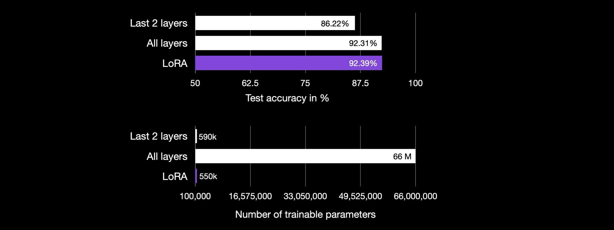

# Code LoRA from Scratch (Copied!)

> see the original blog at: https://lightning.ai/lightning-ai/studios/code-lora-from-scratch?section=featured&tab=overview 

## LoRA From Scratch – Implement Low-Rank Adaptation for LLMs in PyTorch
LoRA, which stands for [Low-Rank Adaptation](https://arxiv.org/abs/2106.09685), is a popular technique to finetune LLMs more efficiently. Instead of adjusting all the parameters of a deep neural network, LoRA focuses on updating only a small set of low-rank matrices.

This Studio explains how LoRA works by coding it from scratch, which is an excellent exercise for looking under the hood of an algorithm.			

## Following the Code Examples

You can find all code to reproduce the results in the article in the accompanying Studio. Just click "**Run**" at the top of this page to access it. After you duplicated the Studio, you will get a complete copy of the code environment and are ready to run the code files. There are no additional installation, download, or other setup steps required.

## Understanding LoRA
Pretrained LLMs are often dubbed foundation models because of their versatility across various tasks. However, it is often useful to adapt a pretrained LLM for a specific dataset or task, which we can accomplish via finetuning.

Finetuning allows the model to adapt to specific domains without costly pretraining, yet updating all layers can still be computationally expensive, especially for larger models.

LoRA offers a more efficient alternative to regular finetuning. As discussed in more detail in the paper [LoRA: Low-Rank Adaptation of Large Language Models](https://arxiv.org/abs/2106.09685), LoRA approximates a layer's weight changes during training, _**ΔW**,_ in a low-rank format.

For instance, whereas in regular finetuning, we compute the weight updates of a weight matrix _**W**_ as **_ΔW_**, in LoRA, we approximate **_ΔW_** through the matrix multiplication of two smaller matrices AB, as illustrated in the figure below. (If you are familiar with PCA or SVD, consider this as decomposing **_ΔW_** into **_A_** and **_B_**.)

For instance, whereas in regular finetuning, we compute the weight updates of a weight matrix _**W**_ as **_ΔW_**, in LoRA, we approximate **_ΔW_** through the matrix multiplication of two smaller matrices AB, as illustrated in the figure below. (If you are familiar with PCA or SVD, consider this as decomposing **_ΔW_** into **_A_** and **_B_**.)


<div style="text-align:center">

<em>A comparison between the weight updates during the forward pass in regular finetuning (left) and LoRA (right).</em></br></br>
</div>


A comparison between the weight updates during the forward pass in regular finetuning (left) and LoRA (right). Select an Image

Note that **_r_**, in the figure above, is a hyperparameter here that we can use to specify the rank of the low-rank matrices used for adaptation. A smaller **_r_** leads to a simpler low-rank matrix, which results in fewer parameters to learn during adaptation. This can lead to faster training and potentially reduced computational requirements. However, with a smaller **_r_**, the capacity of the low-rank matrix to capture task-specific information decreases.

To provide a concrete example, suppose the weight matrix W of a given layer has a size of 5,000x10,000 (50M parameters in total). If we choose a rank _**r=8**_, we initialize two matrices: the 5,000x8-dimensional matrix B and the 8x10,000-dimensional matrix A. Added together, A and B have only 80,000 + 40,000 = 120,000 parameters, which is 400 times smaller than the 50M parameters in regular finetuning via **_ΔW_**.

In practice, it’s important to experiment with different **_r_** values to find the right balance to achieve the desired performance on the new task.

## Coding LoRA from Scratch

Since conceptual explanations can sometimes be abstract, let's now implement LoRA ourselves to get a better idea of how it works. In code, we can implement a LoRA layer as follows:
Here we implement LoRA as the following equation. A little abuse use of $A$ and $B$, opposite to the above figure $A$ and $B$.

$$ \begin{align*} Y &= X(W+\Delta W) = XW + XAB  \\
&= X_{b\times c_{\text{in}}} W_{c_{\text{in}} \times c_{\text{out}}} + X_{b\times c_{\text{in}}} A_{c_{\text{in}} \times r} B_{r \times c_{\text{out}}} 
\end{align*} \quad \text{with } r \ll min(c_{\text{in}}, c_{\text{out}})
$$

where, learnable parameters $A$ and $B$ are initialize as $A \sim \mathcal{N}(0,\, \sigma^{2})$ and $B=0$.

```python
class LoRALayer(torch.nn.Module):
    def __init__(self, in_dim, out_dim, rank, alpha):
        super().__init__()
        std_dev = 1 / torch.sqrt(torch.tensor(rank).float())
        self.A = torch.nn.Parameter(torch.randn(in_dim, rank) * std_dev)
        self.B = torch.nn.Parameter(torch.zeros(rank, out_dim))
        self.alpha = alpha

    def forward(self, x):
        x = self.alpha * (x @ self.A @ self.B)
        return x
```

(You can find this code in the 00_lora-layer.ipynb Jupyter notebook if you want to follow along interactively.)

In the code above, `in_dim` is the input dimension of the layer we want to modify using LoRA, and `out_dim` is the respective output dimension of that layer.

We previously discussed that the rank of the matrices **_A_** and **_B_** is a hyperparameter that controls the complexity and the number of additional parameters introduced by LoRA.

However, looking at the code above, we added another hyperparameter, the scaling factor alpha. This factor determines the magnitude of the changes introduced by the LoRA layer to the model's existing weights: `alpha * (x @ A @ B)`. A higher value of alpha means larger adjustments to the model's behavior, while a lower value results in more subtle changes.

Another thing to note is that we initialized A with small values from a random distribution. Here, the standard deviation of this distribution is determined by the square root of the rank (this choice ensures that the initial values in A are not too large.) However, we initialized B with zeros. The rationale here is that at the beginning of the training, before A and B are updated via backpropagation, the `LoRALayer` does not impact the original weights because _**AB=0**_ if **_B=0_**.

Note that LoRA is usually applied to a neural network's linear (feedforward) layers. For example, suppose we have a simple PyTorch model or module with two linear layers (e.g., this could be the feedforward module of a transformer block). And suppose this module's forward method looks like as follows:

```python
def forward(self, x):
    x = self.linear_1(x)
    x = F.relu(x)
    x = self.linear_2(x)
    return x
```

If we use LoRA, we'd add the LoRA updates to these linear layer outputs as follows:
```python
def forward(self, x):
    x = self.linear_1(x) + self.lora_1(x)
    x = F.relu(x)
    x = self.linear_2(x) + self.lora_2(x)
    return logits
```

In code, when implementing LoRA by modifying existing PyTorch models, an easy way to implement such a LoRA-modification of the linear layers is to replace each Linear layer with a `LinearWithLoRA` layer that combines the Linear layer with our previous `LoRALayer` implementation:

```python
class LinearWithLoRA(torch.nn.Module):
    def __init__(self, linear, rank, alpha):
        super().__init__()
        self.linear = linear
        self.lora = LoRALayer(
            linear.in_features, linear.out_features, rank, alpha
        )

    def forward(self, x):
        return self.linear(x) + self.lora(x)
```

These concepts above are summarized in the following figure.

<div style="text-align:center">

    <em>To apply LoRA, we replace the existing Linear layers in a neural network with the LinearWithLoRA layers that combine both the original Linear layer and the LoRALayer. </em></br></br>
</div>

In practice, to equip and finetune a model with LoRA, all we have to do is replace its pretrained `Linear` layers with our new `LinearWithLoRA` layer. We will see how this works by applying the `LinearWithLoRA` layer to a pretrained language model in the upcoming hands-on section below.

## Finetuning with LoRA -- A Hands-On Example

LoRA is a method that can be applied to various types of neural networks, not just generative models like GPT or image generation models. For this hands-on example, we will train a small BERT model for text classification because classification accuracy is easier to evaluate than generated text. (The full code for these experiments can be found in the `02_finetune-with-lora.ipynb` file in this Studio.)

In particular, we will use a pretrained [DistilBERT](https://arxiv.org/abs/1910.01108) (a smaller version of BERT) model from the [transformers](https://github.com/huggingface/transformers) library:

```python
from transformers import AutoModelForSequenceClassification

model = AutoModelForSequenceClassification.from_pretrained(
    "distilbert-base-uncased", num_labels=2)
```
Since we only want to train the new LoRA weights, we freeze all model parameters by setting `requires_grad` to `False` for all trainable parameters:

```python
for param in model.parameters():
    param.requires_grad = False
```

Next, let's briefly inspect the structure of the model using print(model):
```plain
DistilBertForSequenceClassification(
  (distilbert): DistilBertModel(
    (embeddings): Embeddings(
      (word_embeddings): Embedding(30522, 768, padding_idx=0)
      (position_embeddings): Embedding(512, 768)
      (LayerNorm): LayerNorm((768,), eps=1e-12, elementwise_affine=True)
      (dropout): Dropout(p=0.1, inplace=False)
    )
    (transformer): Transformer(
      (layer): ModuleList(
        (0-5): 6 x TransformerBlock(
          (attention): MultiHeadSelfAttention(
            (dropout): Dropout(p=0.1, inplace=False)
            (q_lin): Linear(in_features=768, out_features=768, bias=True)
            (k_lin): Linear(in_features=768, out_features=768, bias=True)
            (v_lin): Linear(in_features=768, out_features=768, bias=True)
            (out_lin): Linear(in_features=768, out_features=768, bias=True)
          )
          (sa_layer_norm): LayerNorm((768,), eps=1e-12, elementwise_affine=True)
          (ffn): FFN(
            (dropout): Dropout(p=0.1, inplace=False)
            (lin1): Linear(in_features=768, out_features=3072, bias=True)
            (lin2): Linear(in_features=3072, out_features=768, bias=True)
            (activation): GELUActivation()
          )
...
  )
  (pre_classifier): Linear(in_features=768, out_features=768, bias=True)
  (classifier): Linear(in_features=768, out_features=2, bias=True)
  (dropout): Dropout(p=0.2, inplace=False)
)
```

Based on the output below, we can see that the model consists of 6 transformer layers containing linear layers:
```plain
(0-5): 6 x TransformerBlock(
          (attention): MultiHeadSelfAttention(
            ...
            (q_lin): Linear(in_features=768, out_features=768, bias=True)
						...
          )
          ...
```

In addition, the model has two `Linear` output layers:
```plain
...
(pre_classifier): Linear(in_features=768, out_features=768, bias=True)
(classifier): Linear(in_features=768, out_features=2, bias=True)
```

We can selectively enable LoRA for these `Linear` layers by defining the following assignment function and loop:
```python
from functools import partial

# default hyperparameter choices
lora_r = 8
lora_alpha = 16
lora_dropout = 0.05
lora_query = True
lora_key = False
lora_value = True
lora_projection = False
lora_mlp = False
lora_head = False

layers = []

assign_lora = partial(LinearWithLoRA, rank=lora_r, alpha=lora_alpha)

for layer in model.distilbert.transformer.layer:
    if lora_query:
        layer.attention.q_lin = assign_lora(layer.attention.q_lin)
    if lora_key:
        layer.attention.k_lin = assign_lora(layer.attention.k_lin)
    if lora_value:
        layer.attention.v_lin = assign_lora(layer.attention.v_lin)
    if lora_projection:
        layer.attention.out_lin = assign_lora(layer.attention.out_lin)
    if lora_mlp:
        layer.ffn.lin1 = assign_lora(layer.ffn.lin1)
        layer.ffn.lin2 = assign_lora(layer.ffn.lin2)
if lora_head:
    model.pre_classifier = assign_lora(model.pre_classifier)
    model.classifier = assign_lora(model.classifier)
```

We can now inspect the model again to check its updated structure using print(model):
```plain
...
(0-5): 6 x TransformerBlock(
          (attention): MultiHeadSelfAttention(
            (dropout): Dropout(p=0.1, inplace=False)
            (q_lin): LinearWithLoRA(
              (linear): Linear(in_features=768, out_features=768, bias=True)
              (lora): LoRALayer()
            )
            (k_lin): Linear(in_features=768, out_features=768, bias=True)
            (v_lin): LinearWithLoRA(
              (linear): Linear(in_features=768, out_features=768, bias=True)
              (lora): LoRALayer()
            ...
...
```


As we can see above, the `Linear` layers have successfully been replaced by the `LinearWithLoRA` layers.

If we train the model with the default hyperparameter choices shown above, this results in the following performances on the [IMDb Movie Reviews](https://ai.stanford.edu/~amaas/data/sentiment/) classification dataset:

-   Train acc: 92.15%
-   Val acc: 89.98%
-   Test acc: 89.44%

(The full code for these experiments can be found in the `02_finetune-with-lora.ipynb` file in this Studio.)

In the next section, we compare these LoRA finetuning results to traditional finetuning.

## Comparison to Traditional Finetuning

In the previous section, we obtained 89.44% test accuracy with LoRA default settings. How does this compare to traditional finetuning?

Let's start by training the DistilBERT model but only updating the last 2 layers during training. We can achieve this by first freezing all model weights and then unfreezing the two linear output layers:

```python
# freeze all
for param in model.parameters():
    param.requires_grad = False

# unfreeze output layers
for param in model.pre_classifier.parameters():
    param.requires_grad = True

for param in model.classifier.parameters():
    param.requires_grad = True
```

The resulting classification performances, after training only the last two layers, are as follows:

-   Train acc: 86.68%
-   Val acc: 87.26%
-   Test acc: 86.22%

(The full code for these experiments can be found in the `01_finetune-last-layers.ipynb` file in this Studio.)

As we can see, LoRA, with 89.44% test accuracy, compares favorably to only training the last two layers above. In addition, the LoRA configuration above is also much lighter, as it only requires training for 147,456 parameters. In contrast, finetuning the last two layers, which are large, requires updating 592,130 parameters.

Now, how about finetuning all layers?

If we finetune all layers of the DistilBERT model in a conventional fashion, we obtain the following results:

-   Train acc: 96.41%
-   Val acc: 92.80%
-   Test acc: 92.31%

(The full code for these experiments can be found in the `04_finetune-all-layers.ipynb` file in this Studio.)

So, as we can see, finetuning all layers, which involves training 66,955,010 parameters, performs better than both finetuning only the last two layers (592,130 parameters) and the LoRA defaults (147,456 parameters).

As a takeaway message, so far, LoRA performs better than the conventional finetuning of the last two layers even though it uses `4x` fewer parameters. Finetuning all layers requires updating `450x` more parameters than in the LoRA setting but also results in 2% higher test accuracy.

However, one aspect to consider is that we only used LoRA default settings so far. Perhaps we can bridge the gap between the full finetuning and LoRA finetuning with a different LoRA hyperparameter configuration? We will answer this question in the upcoming section.

## Optimizing the LoRA Configuration

The previous LoRA finetuning results were based on the following hyperparameter choices:

```python
lora_r = 8
lora_alpha = 16
lora_dropout = 0.05
lora_query = True
lora_key = False
lora_value = True
lora_projection = False
lora_mlp = False
lora_head = False
```

Note that this only involves applying LoRA to an attention layer's query and value weight matrices. Optionally, we can enable LoRA for other layers as well. Furthermore, we can control the number of trainable parameters in each LoRA layer by modifying the rank (`lora_r`).

To try different hyperparameter configurations, you can use our compact `03_finetune-lora.py` script, which accepts the hyperparameter choices as command line arguments:
```bash
python 03_finetune-lora.py --lora_alpha 32 --lora_r 16
```

In addition, you can also toggle other hyperparameter settings, for example:
```bash
python 03_finetune-lora.py \
--lora_alpha 32 \
--lora_r 16 \
--lora_query True \
--lora_key True \
--lora_value True \
--lora_projection True \
--lora_mlp True \
--lora_head True
```

One way to improve the LoRA performance is to manually fiddle with these hyperparameter choices. However, to make the hyperparameter tuning more convenient, you can also use the `03_gridsearch.py` script, which runs the following hyperparameter grid on all available GPUs:

```python
alpha_values = [1, 4, 8, 16, 32, 64]
rank_values = [1, 2, 4, 8, 16, 32]
devices = range(torch.cuda.device_count())
lora_query = ["True"]
lora_key = ["False", "True"]
lora_value = ["True"]
lora_projection = ["False", "True"]
lora_mlp = ["False", "True"]
lora_head = ["False", "True"]
```

You can run this script from the Visual Studio code or command line terminal or, even better, submit it as a Job. Jobs will automatically shut down once they are finished.

<div style="text-align:center">

    Submitting scripts as a job
<em>Submitting scripts as a job</em></br></br>
</div>


The way the `03_finetune-lora-script.py` script is set up, the results are saved to a `results.txt file`. Inspecting the `results.txt` file after the run is completed, the best hyperparameter configurations seem to be the following:

```plain
lora_r: 8
lora_alpha: 1
lora_query: True
lora_key: False
lora_value: True
lora_projection: False
lora_mlp: True
lora_head: False
```

Resulting in:
-   Val acc: 92.96%
-   Test acc: 92.39%

Note that these accuracies are even slightly higher than those obtained via full finetuning even though the LoRA setting only has a fraction of trainable parameters (500k) versus (66M).

<div style="text-align:center">

<em> To apply LoRA, we replace the existing Linear layers in a neural network with the LinearWithLoRA layers that combine both the original Linear layer and the LoRALayer.</em></br></br>
</div>

## Conclusion

In this Studio, you learned about low-rank adaptation (LoRA) by coding it from scratch. Finetuning a DistilBERT model for classification, we saw that LoRA compared favorably to only finetuning the last layers of a model (92.39% Test accuracy vs 86.22% Test accuracy.)

To check out and play around with the code itself, you can duplicate this Studio by clicking on "**Run**" at the top of this page. This will make a copy of all the code, including the environment, so that you can get started without any additional setup steps.

If you have any questions, please feel free to ping me ([@rasbt](https://twitter.com/rasbt)) or the official [@LightningAI](https://twitter.com/LightningAI) channel on social media or join our [Discord server](https://discord.com/invite/MWAEvnC5fU).

## Additional Resources

-   [Parameter-Efficient LLM Finetuning With Low-Rank Adaptation (LoRA)](https://lightning.ai/pages/community/tutorial/lora-llm/) provides a longer conceptual introduction to LoRA including hands-on examples
-   [Finetuning LLMs with LoRA and QLoRA: Insights from Hundreds of Experiments](https://lightning.ai/pages/community/lora-insights/) summarizes the learnings from hundreds of LoRA experiments
-   [Practical Tips for Finetuning LLMs Using LoRA (Low-Rank Adaptation)](https://magazine.sebastianraschka.com/p/practical-tips-for-finetuning-llms) answers some common questions and provides additional practical insights